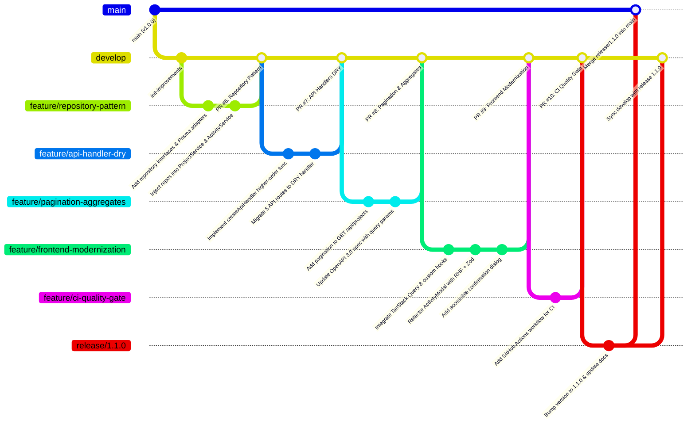

# Plan de Implementación de Mejoras y Buenas Prácticas Arquitectónicas — Trycore EVM Challenge

> **Proyecto**: Trycore EVM Challenge (Earned Value Management Platform)  
> **Documento de Referencia**: *Ingeniero de Desarrollo — Trycore Colombia (1).pdf*  
> **Entorno**: Fullstack Next.js 14 (App Router) + PostgreSQL (Supabase) + Prisma ORM + Vercel Serverless  
> **Estado**: Plan Canónico de Mejoras Técnicas Post-Auditoría  

---

## 1. Alineación con los Estándares del Desafío Trycore Colombia

Conforme a las exigencias explícitas del documento de selección técnica de Trycore:

1. **Cero Code Smells & Principio DRY**: Abstraer la lógica repetida en los controladores de la API, eliminar la duplicación de validaciones entre frontend y backend, y erradicar métodos bloqueantes del navegador (`alert`, `confirm`).
2. **Desacoplamiento y Clean Architecture**: Aislar el núcleo de negocio de la tecnología de persistencia (`PrismaClient`), garantizando que la lógica de aplicación dependa de abstracciones (interfaces de repositorio) y no de implementaciones concretas (DIP - Dependency Inversion Principle).
3. **Cobertura de Pruebas $\ge 80\%$ y Tests de Integración**: Mantener el 100% de cobertura en el motor de cálculo EVM, incorporar pruebas unitarias sobre los nuevos repositorios mockeados y asegurar que cada endpoint de la API mantenga tests de integración automatizados que validen el contrato HTTP.
4. **Gitflow Estricto con Pull Requests**: Todo cambio se desarrollará en ramas `feature/*`, integrándose a `develop` mediante Pull Requests en GitHub con títulos y commits imperativos (`Add repository pattern`, `Refactor API handlers with DRY middleware`, `Implement TanStack Query for dashboard cache`). Ninguna característica se integrará directamente a `main`.
5. **OpenAPI 3.0 Sincronizado**: Cualquier modificación en los endpoints (como la inclusión de parámetros de paginación `page` y `limit`) se reflejará inmediatamente en el contrato OpenAPI servido interactivamente en `/api-docs`.
6. **Compatibilidad con Despliegue en Vercel**: El código debe mantener compatibilidad estricta con funciones serverless de Vercel, optimizando el tamaño del bundle, los tiempos de inicio en frío y la gestión de conexiones con PostgreSQL Supabase (PgBouncer en puerto 6543).

---

## 2. Mapeo de Skills Disponibles en `.agents/skills`

Para la ejecución de cada mejora, se activarán y respetarán las directrices de las siguientes skills especializadas presentes en el workspace:

| Skill | Ubicación | Aplicación en el Plan de Mejoras |
|---|---|---|
| **`vercel-react-best-practices`** | `.agents/skills/vercel-react-best-practices/` | Optimización de renderizado, eliminación de cascadas de promesas (`async-parallel`), deduplicación de peticiones y optimización del bundle cliente de Next.js. |
| **`vercel-composition-patterns`** | `.agents/skills/vercel-composition-patterns/` | Arquitectura de componentes, separación de estado vs. UI, eliminación de *prop drilling* y creación de componentes compuestos para la tabla y modales. |
| **`web-design-guidelines`** | `.agents/skills/web-design-guidelines/` | Accesibilidad web (WCAG): sustitución de `confirm()` y `alert()` por diálogos modales accesibles con focus trap, navegación por teclado (`Escape`, `Tab`) y etiquetas semánticas. |
| **`supabase-postgres-best-practices`** | `.agents/skills/supabase-postgres-best-practices/` | Optimización de consultas SQL, paginación basada en cursor/offset, consultas agregadas (`_sum`, `_count`), uso adecuado de índices y pooling con PgBouncer en Supabase. |
| **`ui-ux-pro-max` & `ui-styling`** | `.agents/skills/ui-ux-pro-max/` | Retroalimentación de estados de carga (skeletons), notificaciones contextuales no bloqueantes (toasts) y semaforización semántica de EVM consistente. |
| **`deploy-to-vercel` & `vercel-optimize`** | `.agents/skills/vercel-optimize/` | Verificación del despliegue serverless en Vercel, control de tamaño del build de producción y configuración de variables de entorno de producción. |
| **`writing-guidelines`** | `.agents/skills/writing-guidelines/` | Redacción técnica clara, formal y transparente en `README.md`, `AI_PROCESS.md` y documentación de la API. |

---

## 3. Hoja de Ruta de Implementación por Fases (Gitflow)



---

### Fase 1: Inversión de Dependencias (Repository Pattern)
* **Rama**: `feature/repository-pattern` (desde `develop`)
* **Skills**: `talleros-backend-engineer`, `vercel-composition-patterns`
* **Objetivo**: Desacoplar la capa de servicios de la infraestructura de persistencia directa (`prisma`), permitiendo inyección de dependencias y pruebas unitarias aisladas sin recurrir al mockeo de módulos globales en Vitest.

#### Archivos a Crear / Modificar:
1. **[NUEVO]** `src/core/repositories/project.repository.interface.ts`:
   - Define el contrato `IProjectRepository`:
     - `findAll(params?: { skip?: number; take?: number }): Promise<ProjectWithActivities[]>`
     - `findById(id: string): Promise<ProjectWithActivities | null>`
     - `create(data: CreateProjectInput): Promise<Project>`
     - `update(id: string, data: UpdateProjectInput): Promise<Project | null>`
     - `delete(id: string): Promise<boolean>`
2. **[NUEVO]** `src/core/repositories/activity.repository.interface.ts`:
   - Define el contrato `IActivityRepository`:
     - `findById(id: string): Promise<Activity | null>`
     - `create(projectId: string, data: CreateActivityInput): Promise<Activity>`
     - `update(id: string, data: UpdateActivityInput): Promise<Activity | null>`
     - `delete(id: string): Promise<boolean>`
3. **[NUEVO]** `src/infrastructure/repositories/prisma-project.repository.ts`:
   - Implementación concreta de `IProjectRepository` utilizando `@/infrastructure/db/prisma`.
4. **[NUEVO]** `src/infrastructure/repositories/prisma-activity.repository.ts`:
   - Implementación concreta de `IActivityRepository` utilizando `@/infrastructure/db/prisma`.
5. **[MODIFICAR]** `src/core/services/project.service.ts`:
   - Convertir de métodos estáticos a clase instanciable con inyección por constructor (o proveedor singleton con fallback por defecto al repositorio de Prisma para no romper retrocompatibilidad):
     ```typescript
     export class ProjectService {
       constructor(
         private readonly projectRepo: IProjectRepository = new PrismaProjectRepository(),
         private readonly activityService = ActivityService
       ) {}
     }
     ```
6. **[MODIFICAR]** `src/core/services/activity.service.ts`:
   - Inyectar `IActivityRepository`.
7. **[MODIFICAR]** `tests/integration/projects.api.spec.ts` & `tests/integration/activities.api.spec.ts`:
   - Actualizar las pruebas para verificar que la inyección o resolución del repositorio opere limpiamente.

* **Criterio de Aceptación**:
  - `npm run test` pasa al 100% (55+ tests).
  - Ningún archivo dentro de `src/core/services/` importa directamente `prisma` desde `@/infrastructure/db/prisma`.

---

### Fase 2: Estandarización de Handlers HTTP y Observabilidad (DRY)
* **Rama**: `feature/api-handler-dry` (desde `develop`)
* **Skills**: `vercel-react-best-practices` (`async-api-routes`), `writing-guidelines`
* **Objetivo**: Eliminar el código repetitivo de validación y control de excepciones en los route handlers, centralizando el logging de errores no controlados.

#### Archivos a Crear / Modificar:
1. **[NUEVO]** `src/infrastructure/http/api-handler.ts`:
   - Implementa la función de orden superior `createApiHandler`:
     - Parsea el cuerpo JSON capturando errores de sintaxis y retornando HTTP 400.
     - Valida el payload con Zod Schema si fue provisto, retornando HTTP 400 con detalles de validación.
     - Ejecuta la función controladora dentro de un bloque protegido.
     - Registra errores fatales con stack trace en consola estructurada (`[API_ERROR] timestamp endpoint error`).
     - Retorna HTTP 500 unificado ante cualquier excepción imprevista.
2. **[MODIFICAR]** `src/app/api/projects/route.ts`
3. **[MODIFICAR]** `src/app/api/projects/[id]/route.ts`
4. **[MODIFICAR]** `src/app/api/projects/[id]/activities/route.ts`
5. **[MODIFICAR]** `src/app/api/activities/[id]/route.ts`
   - Reducción del ~60% de líneas de código redundantes en los controladores.

* **Criterio de Aceptación**:
  - Pruebas de integración de API pasando limpiamente.
  - Validación 400 ante payloads inválidos o JSON malformado intacta.
  - Cero código duplicado en los route handlers.

---

### Fase 3: Paginación y Optimización de Consultas SQL (Escalabilidad)
* **Rama**: `feature/pagination-aggregates` (desde `develop`)
* **Skills**: `supabase-postgres-best-practices` (`query-missing-indexes`, `data-access`), `vercel-react-best-practices`
* **Objetivo**: Evitar la carga completa en memoria RAM de todos los proyectos y actividades, permitiendo paginación eficiente y agregación en base de datos.

#### Archivos a Crear / Modificar:
1. **[MODIFICAR]** `src/core/dto/project.dto.ts`:
   - Crear `PaginationQuerySchema`:
     ```typescript
     export const PaginationQuerySchema = z.object({
       page: z.coerce.number().int().positive().default(1),
       limit: z.coerce.number().int().positive().max(100).default(10),
     });
     export type PaginationQuery = z.infer<typeof PaginationQuerySchema>;
     ```
   - Crear `PaginatedProjectsResponse`:
     ```typescript
     export interface PaginatedProjectsResponse {
       items: ProjectListItemResponse[];
       meta: {
         totalItems: number;
         totalPages: number;
         currentPage: number;
         pageSize: number;
       };
     }
     ```
2. **[MODIFICAR]** `src/core/services/project.service.ts` & `src/infrastructure/repositories/prisma-project.repository.ts`:
   - Implementar cálculo de `skip = (page - 1) * limit` y conteo total con `prisma.project.count()`.
3. **[MODIFICAR]** `src/app/api/projects/route.ts`:
   - Extraer `searchParams` de `req.nextUrl.searchParams` y validar con `PaginationQuerySchema`.
4. **[MODIFICAR]** `src/infrastructure/docs/openapi.spec.ts`:
   - Agregar los parámetros `query` opcionales `page` y `limit` en `GET /api/projects`.
   - Documentar el esquema `PaginatedProjectsResponse`.
5. **[MODIFICAR]** `tests/integration/projects.api.spec.ts`:
   - Test dedicado a verificar la respuesta paginada y metadatos de paginación.

* **Criterio de Aceptación**:
  - `GET /api/projects?page=1&limit=5` responde con 200 OK y estructura paginada.
  - La documentación OpenAPI en `/api-docs` refleja los nuevos parámetros de consulta.

---

### Fase 4: Modernización del Frontend (TanStack Query, RHF y A11y)
* **Rama**: `feature/frontend-modernization` (desde `develop`)
* **Skills**: `vercel-react-best-practices` (`client-swr-dedup`, `rerender-`), `vercel-composition-patterns`, `web-design-guidelines`, `ui-styling`
* **Objetivo**: Desacoplar la UI de llamadas directas a `fetch`, añadir caché en cliente con revalidación en segundo plano, reutilizar esquemas Zod en formularios y reemplazar alertas bloqueantes por diálogos accesibles.

#### Tareas y Archivos:
1. **Instalación de Dependencias**:
   ```bash
   npm install @tanstack/react-query react-hook-form @hookform/resolvers
   ```
2. **[NUEVO]** `src/components/providers/QueryProvider.tsx`:
   - Configuración del cliente de TanStack Query con `staleTime: 60 * 1000` (1 minuto) y `refetchOnWindowFocus: false`.
3. **[MODIFICAR]** `src/app/layout.tsx`:
   - Envolver el contenido con `QueryProvider`.
4. **[NUEVO]** `src/hooks/use-projects.ts`:
   - Encapsular consultas y mutaciones:
     - `useProjects(page, limit)`
     - `useProjectDetail(id)`
     - `useCreateActivity(projectId)`
     - `useUpdateActivity(activityId)`
     - `useDeleteActivity()`
   - Invalidación automática del query key `['project', projectId]` tras cada mutación.
5. **[MODIFICAR]** `src/components/activities/ActivityModal.tsx`:
   - Reemplazar el estado imperativo y la función `validate()` por `useForm<CreateActivityInput>` conectado a `zodResolver(CreateActivitySchema)`.
   - Los mismos mensajes y límites configurados en `src/core/dto/activity.dto.ts` se presentan automáticamente al usuario.
6. **[NUEVO]** `src/components/ui/ConfirmDialog.tsx`:
   - Diálogo accesible de confirmación con soporte para tecla `Escape`, `autofocus` en el botón de confirmación/cancelación y fondo bloqueante con `backdrop-blur`.
7. **[MODIFICAR]** `src/components/dashboard/DashboardClient.tsx`:
   - Reemplazar `confirm()` nativo por `ConfirmDialog`.
   - Simplificar el componente delegando la orquestación a los hooks de React Query.

* **Criterio de Aceptación**:
  - Sin advertencias de React ni renderizados redundantes.
  - Al crear, editar o eliminar una actividad, la tabla y gráfica Recharts se actualizan instantáneamente sin recargar la página completa.
  - Cero llamadas a `confirm()` o `alert()` nativas.

---

### Fase 5: Pipeline de Integración Continua (CI Quality Gate)
* **Rama**: `feature/ci-quality-gate` (desde `develop`)
* **Skills**: `deploy-to-vercel`, `vercel-optimize`
* **Objetivo**: Configurar un flujo automatizado en GitHub Actions que garantice que ningún commit o PR entre a `develop` o `main` si incumple el linter, el formateo, las pruebas o la compilación.

#### Archivos a Crear:
1. **[NUEVO]** `.github/workflows/ci.yml`:
   ```yaml
   name: CI Quality Gate

   on:
     push:
       branches: [main, develop]
     pull_request:
       branches: [main, develop]

   jobs:
     validate:
       name: Lint, Test & Build
       runs-on: ubuntu-latest

       steps:
         - name: Checkout del repositorio
           uses: actions/checkout@v4

         - name: Configurar Node.js 20.x
           uses: actions/setup-node@v4
           with:
             node-version: 20
             cache: 'npm'

         - name: Instalar dependencias con npm ci
           run: npm ci

         - name: Generar cliente de Prisma
           run: npm run prisma:generate

         - name: Verificar formateo de código (Prettier)
           run: npx prettier --check "src/**/*.{ts,tsx,js,jsx,json,css}"

         - name: Ejecutar Linter (ESLint)
           run: npm run lint

         - name: Ejecutar pruebas unitarias y de integración con cobertura (Vitest)
           run: npm run test:coverage

         - name: Verificar compilación de Next.js (Build Check)
           run: npm run build
           env:
             DATABASE_URL: ${{ secrets.DATABASE_URL }}
             DIRECT_URL: ${{ secrets.DIRECT_URL }}
   ```

* **Criterio de Aceptación**:
  - Workflow validado y con status verde en GitHub Actions.

---

### Fase 6: Release 1.1.0 y Despliegue en Vercel
* **Rama**: `release/1.1.0` (desde `develop`)
* **Skills**: `deploy-to-vercel`, `vercel-optimize`, `writing-guidelines`
* **Objetivo**: Estabilizar la versión de mejoras, actualizar la documentación del repositorio y desplegar en producción en Vercel.

#### Tareas:
1. Actualizar `package.json` a versión `1.1.0`.
2. Actualizar `README.md` con los nuevos endpoints paginados y dependencias.
3. Actualizar `AI_PROCESS.md` con la justificación de cada decisión técnica tomada durante la ejecución.
4. Generar Pull Request desde `release/1.1.0` hacia `main`.
5. Merge con merge commit estándar (`--no-ff`).
6. Etiquetar el commit en `main` con el tag `v1.1.0`:
   ```bash
   git tag -a v1.1.0 -m "Release 1.1.0: Clean Architecture, Repository Pattern, TanStack Query and CI Pipeline"
   git push origin v1.1.0
   ```
7. Sincronizar de vuelta hacia `develop`:
   ```bash
   git checkout develop
   git merge release/1.1.0 --no-ff
   git push origin develop
   ```
8. Verificar que el despliegue automático en Vercel complete exitosamente y validar la URL pública en producción.

---

## 4. Matriz de Riesgos y Mitigaciones

| Riesgo | Probabilidad | Impacto | Estrategia de Mitigación |
|---|:---:|:---:|---|
| **Rompimiento de Contrato en la API**: Modificar `GET /api/projects` para devolver un objeto `{ items, meta }` podría romper clientes existentes. | Media | Alto | Mantener compatibilidad admitiendo flag o envoltorio retrocompatible, y actualizar la UI y la suite de tests simultáneamente en el mismo PR. |
| **Agotamiento de Conexiones Serverless en Vercel**: Crear múltiples instancias de repositorios que instancien Prisma. | Baja | Crítico | Mantener la inyección apuntando al singleton `prisma` global ya configurado en `@/infrastructure/db/prisma.ts`. |
| **Tiempo de Compilación en CI por falta de variables**: El comando `next build` en GitHub Actions falla si no encuentra `DATABASE_URL`. | Media | Medio | Configurar las variables como GitHub Repository Secrets y añadir fallback en build si se requiere export estático. |

---

## 5. Registro de Decisión Arquitectónica (ADR)

* **ADR-001: Adopción del Patrón Repositorio en Next.js App Router**
  - **Contexto**: `ProjectService` y `ActivityService` dependían directamente de `@prisma/client`.
  - **Decisión**: Introducir interfaces `IProjectRepository` e `IActivityRepository` en la capa Core. La infraestructura provee adaptadores que encapsulan Prisma.
  - **Consecuencias Positivas**: El dominio queda 100% puro. Las pruebas unitarias pueden inyectar implementaciones en memoria sin librerías de mockeo de módulos. Facilita la migración a otros motores de base de datos o almacenamiento en caché en el futuro.
* **ADR-002: Reutilización de Schemas Zod en Formularios de Cliente**
  - **Contexto**: `ActivityModal` mantenía 40 líneas de código manual con sentencias `if/else` validando los campos, duplicando el esquema de backend.
  - **Decisión**: Integrar `react-hook-form` con `@hookform/resolvers/zod` consumiendo directamente `CreateActivitySchema` de `src/core/dto/activity.dto.ts`.
  - **Consecuencias Positivas**: Se garantiza el principio de Fuente Única de Verdad (*Single Source of Truth*). Si las reglas de negocio del formulario cambian (ej. límite de BAC o precisión de avance), solo se modifica el esquema Zod una única vez.
